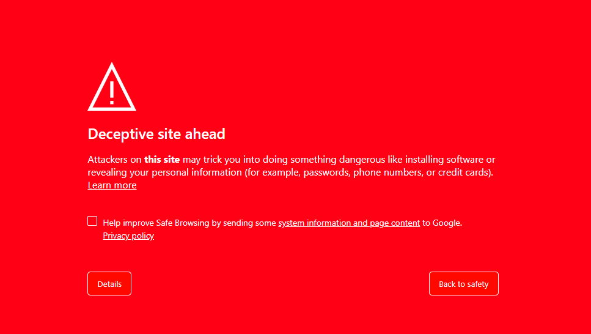

# Deceptive Site Ahead Warning

## Google Safe Browsing

This project is a **mock warning page** inspired by Google's "Deceptive Site Ahead" warning. It is designed for educational purposes, UI/UX testing, and cybersecurity awareness.

🚨 **Warning:** This is not a real phishing site or an actual security warning. It is purely for demonstration purposes.

## 📌 Features

✅ Responsive UI with a warning message  
✅ "Go Back" button to return to the previous page  
✅ "Advanced" button to reveal additional details  
✅ Clean and customizable CSS styling  

## 📂 File Structure

```
/deceptive-site-warning
│── index.html        # Main HTML file
│── css/
│   ├── style.css     # Styles for the warning page
│── README.md         # Documentation
```

## 🎨 Preview



## 🚀 How to Use

1. Download or clone this repository:
   ```sh
   git clone https://github.com/yourusername/deceptive-site-warning.git
   ```
2. Open `index.html` in a browser to view the warning page.

## 🛠 Customization

You can modify the styles in `css/style.css` to adjust the appearance of the warning.

- Change background color  
- Update text messages  
- Modify button styles  

## 📜 License

This project is licensed under the **MIT License**. Feel free to use and modify it for educational purposes.

---

🔗 **Disclaimer:** This project is only for educational and UI/UX testing purposes. Do not use it for deceptive or malicious activities.

